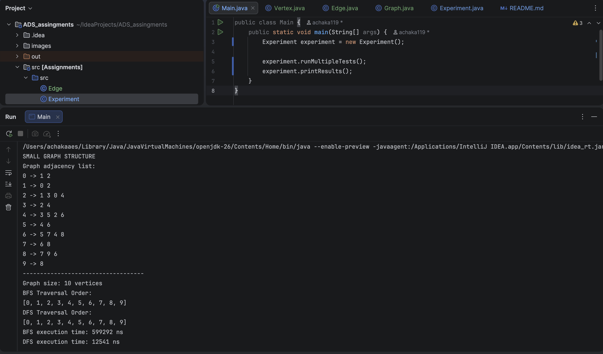
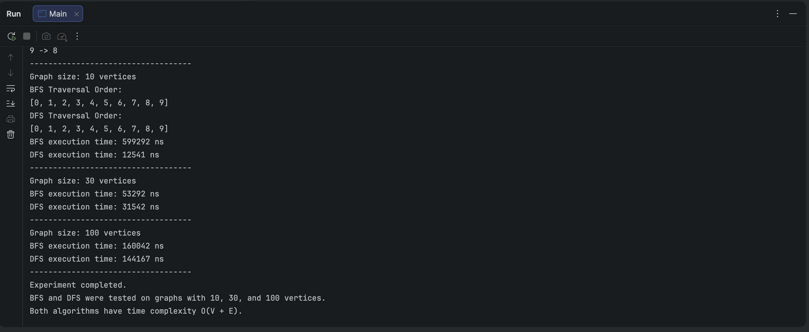

# ADS_assingments
### Name: Askar Kairatbek

### Group: IT-2501

#### Assignment 4

# Assignment 4: Graph Traversal and Representation System

## Project Overview

This project is a Java program that represents a graph using an adjacency list and performs two graph traversal algorithms:

- Breadth-First Search (BFS)
- Depth-First Search (DFS)

The purpose of this assignment is to understand graph structures, graph representation, traversal algorithms, and performance analysis.
A graph is a data structure made of vertices and edges.

- A vertex is a node in the graph.
- An edge is a connection between two vertices.
- A graph is a collection of vertices and edges.

Example graph:

```text
0 ----- 1
|       |
2 ----- 3
```

## Vertex Class

The Vertex class represents one node in the graph.
Each vertex has a unique ID.

Main methods:

```text
Vertex(int id)
getId()
toString()
```

The getId() method returns the ID of the vertex.
The toString() method returns a readable text representation of the vertex.

## Edge Class

The Edge class represents a connection between two vertices.

It stores:

1) source vertex
2) destination vertex

Main methods:

````text
Edge(Vertex source, Vertex destination)
getSource()
getDestination()
toString()
````

The getSource() method returns the starting vertex.
The getDestination() method returns the ending vertex.

## Graph Class

The Graph class represents the full graph structure.
It uses an adjacency list to store the graph.

Example:

0 -> 1 2

1 -> 0 3

2 -> 0

3 -> 1

This means:
Vertex 0 is connected to vertices 1 and 2

Vertex 1 is connected to vertices 0 and 3

Vertex 2 is connected to vertex 0

Vertex 3 is connected to vertex 1

Main methods:

```text
addVertex(Vertex v)
addEdge(int from, int to)
printGraph()
bfs(int start)
dfs(int start)
```

The addVertex() method adds a new vertex to the graph.
The addEdge() method adds a connection between two vertices.
The printGraph() method prints the graph structure.
The bfs() method performs Breadth-First Search.
The dfs() method performs Depth-First Search.

# Algorithm Descriptions
### Breadth-First Search, BFS

Breadth-First Search is a graph traversal algorithm that visits vertices level by level.
BFS starts from one vertex, visits all of its direct neighbors first, then visits the neighbors of those neighbors.
BFS uses a queue.

A queue follows the First In, First Out rule.
This means the first vertex added to the queue will be processed first.

BFS Step-by-Step Explanation:

Start from the selected vertex.
Mark the starting vertex as visited.
Add the starting vertex to the queue.
Remove the first vertex from the queue.
Visit all unvisited neighbors of that vertex.
Add those neighbors to the queue.
Repeat until the queue is empty.

BFS is useful for:

finding the shortest path in an unweighted graph,
exploring a graph level by level,
finding the closest connection,
checking if a graph is connected,
social network connection search.

The time complexity of BFS is:

O(V + E)

Where:
V is the number of vertices,
E is the number of edges

BFS visits each vertex once and checks each edge once.

### Depth-First Search, DFS

DFS goes as deep as possible before going back.
It starts from one vertex, visits one neighbor, continues deeper, 
and then backtracks when there are no more unvisited neighbors.
DFS can be implemented using recursion or a stack.

DFS Steps:

Start from a vertex.
Mark it as visited.
Visit one unvisited neighbor.
Continue going deeper.
If there are no unvisited neighbors, go back.
Repeat until all reachable vertices are visited.

DFS is useful for:

path finding,
cycle detection,
connected components,
exploring all possible paths.

DFS Complexity:
O(V + E)

Where:
V is the number of vertices, 
E is the number of edges


| Graph Size | BFS Time (ns) | DFS Time (ns) |
|---|---------------|---------------|
| 10 vertices | 776625        | 16208         |
| 30 vertices | 123750        | 171125        |
| 100 vertices | 163250        | 76250         |







# Analysis
### How does graph size affect BFS and DFS performance?

When the graph size increases, the execution time usually increases too.
This is because both BFS and DFS need to visit more vertices and edges.
The graph with 100 vertices takes more time than the graph with 10 vertices.

### Which traversal is faster?

In my experiment, DFS was slightly faster than BFS.
However, the difference was small.
Both algorithms have similar performance because both have the same time complexity: O(V + E).

### Do the results match O(V + E)?

Yes, the results match the expected complexity.
BFS and DFS both visit each vertex and each edge once.
Therefore, as the number of vertices and edges increases, the execution time also increases.

### How does graph structure affect traversal order?

Graph structure affects the order of traversal.
BFS visits nearby vertices first.
DFS goes deep into one path before returning to other vertices.
The traversal order also depends on the order of neighbors inside the adjacency list.

### When is BFS preferred over DFS?

BFS is preferred when we need to find the shortest path in an unweighted graph.
It is also useful when we want to explore nodes level by level.

### What are the limitations of DFS?

DFS does not always find the shortest path.
DFS can also go very deep in large graphs.
If recursion is used, it may cause a stack overflow.

## Reflection

In this project, I learned how to represent a graph using an adjacency list in Java. 
I also learned how vertices and edges are used to build a graph structure.
I learned that BFS and DFS are both important graph traversal algorithms. 
BFS visits vertices level by level and is useful for finding the shortest path in an unweighted graph. 
DFS goes deep into one path before backtracking and is useful for exploring paths and detecting cycles.
One challenge was understanding how the visited set works. 
It is important because it prevents the program from visiting the same vertex many times.

