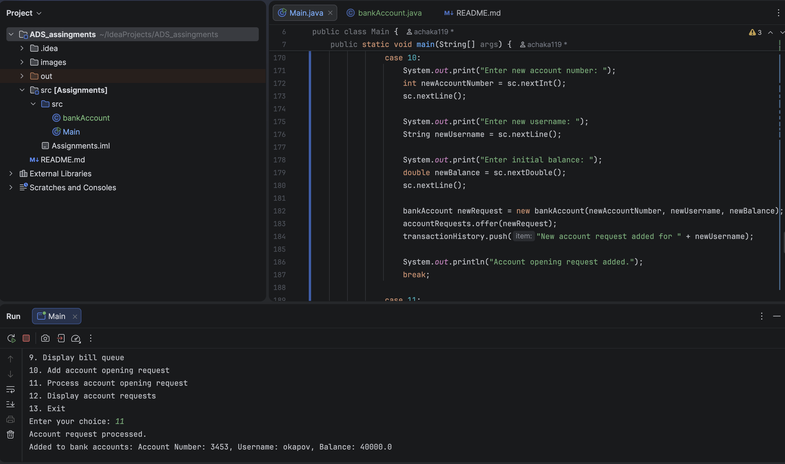

# ADS_assingments
### Name: Askar Kairatbek

### Group: IT-2501

#### Assignment 1

### Task 1: 
To print digits of a number, I first called the function for `n / 10` and then printed `n % 10`.  
This helped print the digits in the correct order.

### Task 2: 
To find the average, I used recursion to calculate the sum of all array elements.  
After finding the sum, I divided it by the number of elements.

### Task 3: 
To check if a number is prime, I tested divisibility starting from `2`.  
If the number was divisible by any smaller number, it was composite.  
If not, it was prime.

### Task 4: 
To find factorial, I used the rule:

`n! = n × (n - 1)!`

The recursion stops when `n` becomes `0` or `1`.

### Task 5:
To find the Fibonacci number, I used the formula:

`F(n) = F(n-1) + F(n-2)`

The base cases were `F(0) = 0` and `F(1) = 1`.

### Task 6:
To calculate power, I used:

`a^n = a × a^(n-1)`

The recursion stops when `n = 0`, because any number to the power of `0` equals `1`

### Task 7:
To print numbers in reverse order, I first read one number, then called the function for the remaining numbers, and printed the current number after the recursive call.  
This automatically printed the numbers in reverse.

### Task 8:
To check if a string contains only digits, I examined one character at a time.  
If all characters were digits, the function returned `"Yes"`.  
If at least one character was not a digit, it returned `"No"`.

### Task 9:
To count characters in a string, I counted one character and then called the function for the rest of the string.  
The recursion stopped when the string became empty.

### Task 10
To find the greatest common divisor, I used the Euclidean algorithm:
`gcd(a, b) = gcd(b, a % b)`

The recursion stops when `b = 0`.

